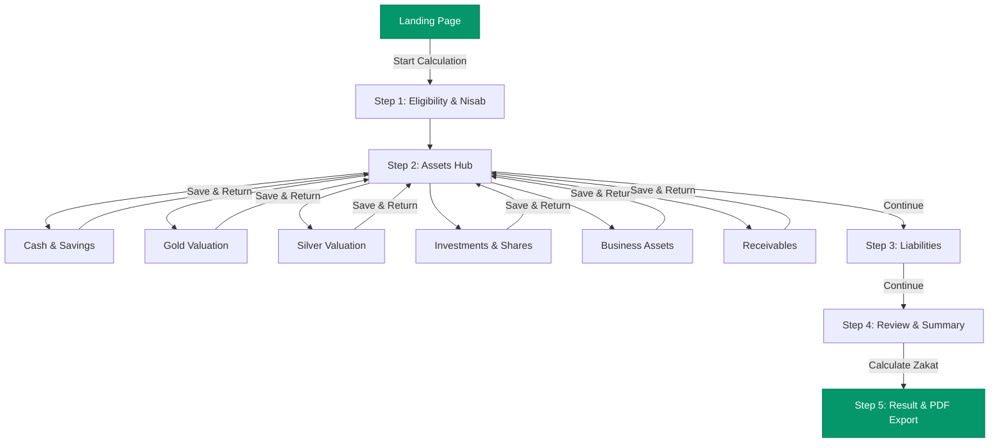

# 🌙 Zakat Companion (زکوٰۃ کمپینین)

<div align="center">


<p align="center">
  <strong>A modern, privacy-first, guided Zakat calculation application with bidirectional English & Urdu (RTL) support and an integrated AI educational assistant.</strong>
</p>

</div>

---

> [!IMPORTANT]
> **Methodology Status & Religious Notice**:
> The calculator currently uses defined **development methodology defaults** that are pending formal religious/scholar review. Zakat Companion is an educational and calculation-support tool and does not constitute a formal Islamic ruling (fatwa).

---

## 🌟 Key Features

### 🧮 1. Step-by-Step Guided Calculator Wizard
A clear, non-overwhelming step-by-step wizard that walks users through:
- **Eligibility & Nisab**: Preliminary check based on lunar year (Hawl) and Nisab wealth thresholds.
- **Zakatable Assets**:
  - 💵 **Cash & Savings**: Cash in hand, bank accounts, prize bonds, and foreign currency.
  - 🥇 **Gold**: Multi-karat purity weighting (24K, 22K, 21K, 18K) against live market spot prices.
  - 🥈 **Silver**: Weight in grams against live market rates.
  - 📈 **Investments**: Public stocks, mutual funds, and equity investments at market valuation.
  - 🏢 **Business Assets**: Stock-in-trade and liquid business cash.
  - 🤝 **Receivables**: Expected good loans and repayments.
- **Liabilities & Deductions**: Short-term immediate debts and living expenses due.
- **Interactive Review**: Full summary with real-time recalculation and category edit shortcuts.
- **Visual Result Breakdown**: Clear breakdown showing total assets, deductible liabilities, Nisab threshold, and final payable Zakat.

### 🌐 2. Seamless English ↔ Urdu Bilingual Experience
- **Instant Toggle**: Switch between English (`ltr`) and Urdu (`rtl`) dynamically at any point.
- **100% Data Retention**: Changing languages never resets, clears, or modifies entered user values.
- **Typography & Layout**: Tailored typography and mirrored UI design for native Urdu readability.

### 🤖 3. AI Educational Assistant (Google Gemini)
- Integrated floating AI assistant powered by **Gemini 3.8 / 3.7 Flash**.
- Explains core Zakat concepts (Hawl, Nisab, eligible assets, fiqh differences).
- Context-aware responses that transparently clarify the application's configured development defaults.
- Zero financial calculations in chat: guides users directly to the verified calculation wizard.

### 📄 4. PDF Summary Generation
- Instant client-side download of a formatted calculation summary.
- Generates structured PDF reports in both English and Urdu with metadata, disclaimers, and category breakdowns.

### 🔒 5. Privacy by Design
- **No Database Storage**: Calculations exist entirely within the client session.
- **No Accounts Required**: No login, sign-up, or tracking of personal financial identity.
- **Safe API Pipelines**: Zero sensitive financial credentials or user data are stored on servers.

---

## 📐 Calculation Engine & Methodology

The core calculation logic is strictly decoupled from the UI in [`lib/zakat/`](./lib/zakat/):

| Parameter | Development Default | Description |
| :--- | :--- | :--- |
| **Zakat Rate** | **2.5%** | Applied to net zakatable wealth completing one lunar year (*Hawl*). |
| **Silver Nisab (Default)** | **612.36 grams** (52.5 Tola) | Primary threshold standard dynamically valued via spot price. |
| **Gold Nisab (Alternate)** | **87.48 grams** (7.5 Tola) | Alternate threshold standard valued via spot price. |
| **Gold Valuation** | `Price × Weight × (Karat / 24)` | Calculated based on standard purity ratios (24K, 22K, 21K, 18K). |
| **Silver Valuation** | `Price × Weight` | Spot valuation per gram. |
| **Liquid Assets** | `100%` of entered market value | Cash, stocks, business stock, and good receivables. |
| **Liabilities** | Subtracted from Total Assets | Deductible short-term liabilities due immediately. |

---

## 🗺️ Application Workflow



---

## 🛠️ Tech Stack

- **Framework**: [Next.js 16](https://nextjs.org/) (App Router, Turbopack)
- **UI & Styling**: [React 19](https://react.dev/), [Tailwind CSS v4](https://tailwindcss.com/)
- **Language**: [TypeScript 5](https://www.typescriptlang.org/)
- **AI Integration**: [Google Gemini Flash API](https://ai.google.dev/)
- **Metal Rates API**: Spot Gold & Silver Pricing API
- **PDF Engine**: [PDFKit](https://pdfkit.org/)
- **Test Runner**: [TSX](https://github.com/privatenumber/tsx) (Direct TypeScript execution)

---

## 📁 Project Structure

```text
zakat-companion/
├── app/
│   ├── api/
│   │   ├── chat/route.ts          # AI Chatbot endpoint (Gemini Flash)
│   │   ├── metals/route.ts        # Gold & silver market price provider
│   │   └── pdf/route.ts           # Server-side PDF generator
│   ├── calculator/
│   │   ├── assets/                # Asset category subpages (cash, gold, silver, etc.)
│   │   ├── eligibility/           # Nisab qualification step
│   │   ├── liabilities/           # Deductible liabilities form
│   │   ├── review/                # Interactive summary & review page
│   │   ├── result/                # Final calculation breakdown & PDF trigger
│   │   └── layout.tsx             # Calculator stepper & responsive layout
│   ├── error.tsx                  # Global error boundary
│   ├── globals.css                # Tailwind CSS v4 design tokens & fonts
│   ├── icon.svg                   # Next.js App Router SVG site icon
│   ├── favicon.ico                # Multi-resolution ICO favicon
│   ├── layout.tsx                 # Root layout with metadata & providers
│   └── page.tsx                   # Landing page
├── components/
│   ├── chatbot/ChatbotWidget.tsx  # Floating bilingual AI assistant
│   ├── landing/                   # Header, Footer, Hero, FAQs, Features
│   └── ui/                        # Button, Card, Input, Alert, Spinner
├── context/
│   ├── CalculatorContext.tsx      # Zakat state engine provider
│   └── LanguageContext.tsx        # English/Urdu & RTL global synchronization
├── docs/
│   └── ZAKAT_METHODOLOGY_CONFIRMATION.md # Religious methodology & scholar review docs
├── lib/
│   ├── api/                       # Gemini & Metals API clients + unit tests
│   ├── i18n/                      # Translations & language unit tests
│   ├── pdf/                       # PDF document builder & unit tests
│   ├── zakat/                     # Core calculation engine, Nisab & valuation logic
│   ├── accessibility.test.ts      # WCAG AA & ARIA test suite
│   └── validation.ts              # Input sanitization & security rules
├── public/                        # Static assets & favicons
├── .env.example                   # Environment variable template
├── package.json                   # Project dependencies & scripts
└── tsconfig.json                  # TypeScript compiler settings
```

---

## 🚀 Getting Started

### 1. Prerequisites
- **Node.js**: `v20.x` or higher
- **npm**: `v10.x` or higher

### 2. Installation
```bash
git clone https://github.com/MuhammadNihalImran/zakat_project.git
cd zakat_project
npm install
```

### 3. Environment Setup
Copy the example environment file:
```bash
cp .env.example .env.local
```

Configure your credentials in `.env.local`:
```env
# Gold & Silver Live Pricing
GOLD_SILVER_API_KEY=your_metals_api_key_here
GOLD_SILVER_API_URL=https://api.metals.dev/v1/latest

# Google Gemini AI Assistant
GEMINI_API_KEY=your_gemini_api_key_here
GEMINI_API_URL=https://generativelanguage.googleapis.com
GEMINI_MODEL=gemini-3.8-flash
```

> [!WARNING]
> Never commit `.env.local` or push active API keys to public repositories.

### 4. Run Development Server
```bash
npm run dev
```
Open [http://localhost:3000](http://localhost:3000) in your browser.

---

## 🧪 Testing Suite

Run the full automated test suite (89 unit, accessibility, and integration tests):

```bash
npm test
```

### Test Coverage Breakdown:
| Suite | File | Tests | Status |
| :--- | :--- | :---: | :---: |
| **Calculation Engine** | `lib/zakat/engine.test.ts` | 14/14 | ✅ PASS |
| **Nisab Thresholds** | `lib/zakat/nisab.test.ts` | 4/4 | ✅ PASS |
| **Asset Valuation** | `lib/zakat/valuation.test.ts` | 9/9 | ✅ PASS |
| **Validation & Security** | `lib/validation.test.ts` | 17/17 | ✅ PASS |
| **i18n & RTL Symmetry** | `lib/i18n/language.test.ts` | 5/5 | ✅ PASS |
| **Accessibility (WCAG AA)** | `lib/accessibility.test.ts` | 6/6 | ✅ PASS |
| **AI Chatbot (Gemini)** | `lib/api/gemini.test.ts` | 14/14 | ✅ PASS |
| **Metals API Integration** | `lib/api/metals.test.ts` | 10/10 | ✅ PASS |
| **PDF Generator** | `lib/pdf/generator.test.ts` | 10/10 | ✅ PASS |
| **Total** | | **89 / 89** | **100% PASS** |

---

## 📦 Production Build

To verify production compilation with TypeScript and Next.js Turbopack:

```bash
npm run build
```

To run the production bundle locally:
```bash
npm run start
```

---

## ☁️ Deployment (Vercel)

1. Push your repository to GitHub.
2. Import the repository into [Vercel](https://vercel.com).
3. In Project Settings → **Environment Variables**, configure:
   - `GEMINI_API_KEY`
   - `GEMINI_API_URL`
   - `GOLD_SILVER_API_KEY`
   - `GOLD_SILVER_API_URL`
4. Click **Deploy**. Vercel will automatically build and serve the application globally with serverless API routes.

---

## 📜 License

This project is open source and available under the [MIT License](LICENSE).

---

<div align="center">
  <sub>Built with care for Muslims in Pakistan seeking a simple, transparent, and privacy-first Zakat calculation experience.</sub>
</div>

